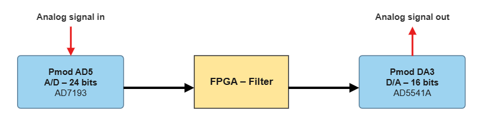
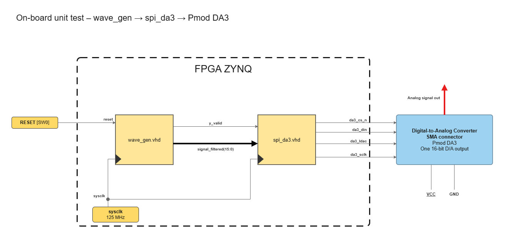

# FPGA FIR Low-Pass Filter for Zybo Z7-10

A verified FPGA signal-processing chain for the Digilent Zybo board. From a composite input `50 Hz + 500 Hz`, the FIR low-pass filter keeps the 50 Hz sinusoid and removes the 500 Hz one.



The filter is designed and studied in MATLAB, implemented in VHDL with Vivado (simulation, synthesis and implementation), and verified step by step, from simulation to measurements on the real board with an Analog Discovery 3.

## Repository Structure

```text
matlab/                    Filter study
rtl/final_design/          VHDL source files of the final design
rtl/unit_tests_on_board/   Unit tests on the real board
sim/                       Simulation testbenches
docs/img/                  Figures used in the READMEs
```

The repository follows the order of the project:

1. **[`matlab/`](matlab/)**: where the filter is designed. Choice of the sampling frequency, FIR design (`fir1`, Hamming window, `fc = 190 Hz`, order 50) and analysis (Bode plot, step response). It also holds the fixed-point study: Q15 quantization of the coefficients, bus widths (input, product, accumulator, output), accumulator sizing from the sum of the coefficients, and output saturation. It produces the coefficients and number formats used by the VHDL.
2. **`rtl/final_design/`**: all the VHDL source files of the final chain.
3. **[`sim/`](sim/)**: Block-level testbenches for design verification in simulation, representing the software-verification steps of the V-cycle before moving to hardware testing
4. **[`rtl/unit_tests_on_board/`](rtl/unit_tests_on_board/)**: each block tested on the real board, one folder per test. Its README lists the tests with a link to each folder.

This order matches the V-cycle described below: design first, then verification, from simulation to the board.


## Target platform

| Item | Target |
| --- | --- |
| FPGA board | Digilent Zybo Z7-10 |
| FPGA device | AMD/Xilinx XC7Z010 |
| Fabric clock | 125 MHz (8 ns period) |
| ADC module | Digilent Pmod AD5, AD7193, 24-bit sigma-delta ADC |
| DAC module | Digilent Pmod DA3, AD5541A, 16-bit DAC |
| Instrument | Analog Discovery 3 (signal generator and oscilloscope) |
| HDL | VHDL |
| Tools | Vivado, MATLAB |

## Specification

| Parameter | Value |
| --- | --- |
| Sampling frequency | 4800 Hz (maximum rate of the AD7193) |
| Filter | FIR, order 50 (51 coefficients), Hamming window, `fc = 190 Hz` |
| Passband | 0-50 Hz, loss ≤ 0.2 dB (measured: −0.11 dB) |
| Stopband | ≥ 450 Hz, attenuation ≥ 60 dB (measured worst case: −68.0 dB) |
| Number format | Q15 input, coefficients and output; 32-bit Q2.30 accumulator |

A FIR filter was chosen over IIR and FFT filtering for its linear phase and unconditional stability. The full study is in [`matlab/`](matlab/).

## Verification approach (V-cycle)

Each level of the design is verified by a matching test.

| Design | Verification |
| --- | --- |
| Requirements: keep 50 Hz, reject 500 Hz, loss ≤ 0.2 dB | System validation: oscilloscope measurements against the specification |
| Architecture: ADC → FIR → DAC, fixed-point formats | Integration test: the complete chain |
| Detailed design of each block (SPI state machines, FIR datapath) | Unit tests: a simulation testbench per block, then a test on the real board |
| VHDL implementation | |

Unit tests exist at two levels: in simulation (`sim/`) and on the board in real conditions ([`rtl/unit_tests_on_board/`](rtl/unit_tests_on_board/)). For example, the DAC is tested on the board with `wave_gen → spi_da3 → Pmod DA3`, observed on the oscilloscope.



## Skills

`VHDL` · `RTL Design` · `FIR Filter Design` · `Fixed-Point Arithmetic` · `FSM Design` · `SPI Interface` · **Static Timing Analysis (WNS / TNS)** · **Hardware Debug / Logic Analyzer** · `Testbench / Simulation` · `Xilinx Vivado` · `MATLAB`
