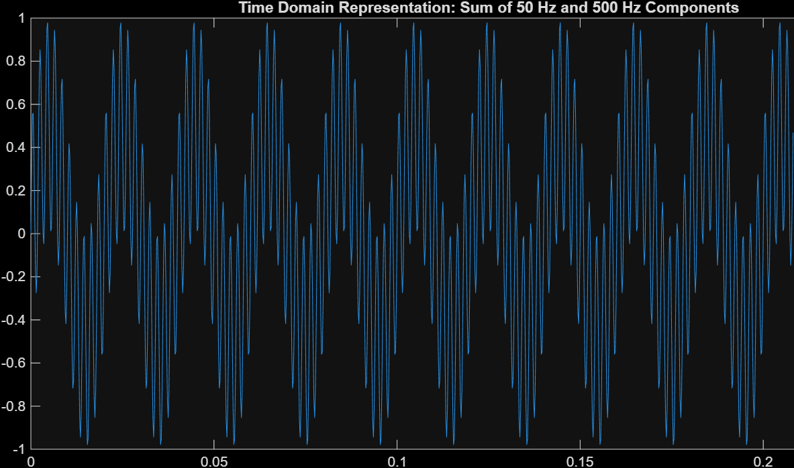

# MATLAB: Filter Study

This folder holds the design and the fixed-point study of the FIR low-pass filter. [`filter_design.m`](filter_design.m) reproduces every figure below. The results of this study (coefficients, number formats, bus widths) are what the VHDL in [`rtl/final_design/`](../rtl/final_design/) implements.

**Goal:** from `50 Hz + 500 Hz`, keep the 50 Hz sinusoid (loss ≤ 0.2 dB) and reject the 500 Hz one (attenuation ≥ 60 dB).

## 1. Test signal and sampling frequency

The input is the sum of two sinusoids, each with amplitude 0.5 so that the sum stays within ±1 (full scale in Q15):

`x(t) = 0.5·sin(2π·50·t) + 0.5·sin(2π·500·t)`
<p align="center">
  
</p>

The sampling frequency is **`Fs = 4800 Hz`**, the maximum output rate of the AD7193 (Pmod AD5). The filter is designed at the same `Fs` as the real hardware: a digital filter only sees the ratio `f / Fs`, so a design done at a different `Fs` would shift the whole frequency response. The highest frequency of interest, 500 Hz, is far below `Fs/2 = 2400 Hz`, so the Nyquist–Shannon criterion is respected with margin.

## 2. Choice of the algorithm

Three approaches were compared for real-time filtering on an FPGA:

| Criterion | FIR | IIR | FFT filtering |
| --- | --- | --- | --- |
| Stability | Always stable | Can become unstable | Stable (block processing) |
| Phase | Linear | Non-linear | Depends on the mask |
| Hardware cost | Medium to high | Low | Very high (FFT + IFFT) |
| Latency | Medium | Very low | High (block latency) |
| Sensitivity to quantization | Low | High | n/a |
| Real-time fit | Yes | Yes | Difficult |

**FIR was chosen.** Linear phase means no phase distortion between frequencies, and the absence of feedback guarantees stability for any input. The price is more coefficients, hence more multiply-accumulate operations (51 per sample here). IIR would need fewer resources but distorts the phase and is more sensitive to quantization in fixed point. FFT filtering works on blocks of samples, which adds block latency and costs a lot of resources, so it does not fit a strictly real-time chain.

Reference: [Difference between IIR and FIR filters: a practical design guide](https://www.advsolned.com/difference-entre-les-filtres-rii-et-rif-un-guide-pratique-de-conception/).

## 3. FIR design

| Parameter | Value | Rationale |
| --- | --- | --- |
| Method | `fir1`, low-pass, Hamming window | Symmetric coefficients, linear phase |
| Order | 50 (51 coefficients) | Reduction tests were done; comfortable margin |
| Cutoff `fc` | 190 Hz | Between 50 Hz and 450 Hz; the −6 dB point of `fir1` is far from 50 Hz |
| `Fs` | 4800 Hz | Real sampling rate of the hardware |

```matlab
b = fir1(50, 190/(4800/2), 'low');
```

The specification and the measured results:

| Requirement | Target | Result |
| --- | --- | --- |
| Passband 0–50 Hz | loss ≤ 0.2 dB | −0.11 dB (amplitude × 0.987) |
| Stopband ≥ 450 Hz | attenuation ≥ 60 dB | −68.0 dB (worst case over the whole band) |
| Transition 50–450 Hz | no requirement | side lobe at −51.8 dB near 400 Hz, accepted |

The stopband is sized on the **worst case over the whole band**, never on a single notch: a notch at 500 Hz moves as soon as `Fs` or the frequency changes.

## 4. Filter analysis

### Frequency response


The 50 Hz component is kept almost untouched and the 500 Hz component is strongly attenuated. The phase is linear in the passband, which is the expected behavior of a symmetric FIR.

### Impulse response and delay

The impulse response of an FIR filter is its coefficients. It is symmetric, which explains the linear phase and a constant delay of **25 samples (5.2 ms at 4800 Hz)**. All poles sit at the origin, so the filter is unconditionally stable.

### Step response


The output settles to ±5 % after about 33 samples and to ±1 % after about 45. It is exact after 51 samples. The overshoot is about 3 % (Gibbs effect).

## 5. Result on the test signal

The filtered signal is the 50 Hz sinusoid. It is delayed by the filter but not distorted:


## 6. Fixed-point study

### Quantization of the coefficients (Q15)

The coefficients are rounded to 16 bits in Q15 (`round(b · 2^15)`) and the filter is applied again with the quantized values. The Q15 output overlaps the floating-point output:


| | Worst-case stopband attenuation |
| --- | --- |
| Floating point | −68.0 dB |
| Q15 coefficients | −67.6 dB |

Rounding to Q15 costs only **0.4 dB**, so 16 bits are enough.

### Number formats

- **Q15** (1 sign bit + 15 fractional bits): range −1.0 to +0.99997, LSB = 2⁻¹⁵ ≈ 3.05·10⁻⁵. Used for the input samples, the coefficients and the output.
- **Q2.30** (1 sign bit + 1 integer bit + 30 fractional bits, 32 bits): range −2.0 to +1.99999, LSB = 2⁻³⁰. Used for the products and the accumulator, since Q15 × Q15 = Q30.

| Bit | 31 | 30 | 29 | 28 | 27 | … |
| --- | --- | --- | --- | --- | --- | --- |
| Weight | −2¹ | 2⁰ | 2⁻¹ | 2⁻² | 2⁻³ | … |

### Bus widths

| Element | Format | Width |
| --- | --- | --- |
| Input sample | Q15 | 16 bits signed |
| Coefficient | Q15 | 16 bits signed |
| Product | Q30 | 32 bits |
| Accumulator | Q2.30 | 32 bits |
| Output | Q15 | 16 bits signed |

### Accumulator width

A first, coarse bound assumes the worst case for every term: a 16-bit × 16-bit product summed 51 times needs `16 + 16 + ceil(log2(51)) = 38 bits`.

Using the real coefficients gives a tighter bound. The worst case is a full-scale input (2¹⁵) multiplied by the sum of the absolute values of the Q15 coefficients:

```matlab
acc_max  = 2^15 * sum(abs(b_q15));          % = 32768 × 37148 ≈ 1.22·10^9
acc_bits = floor(log2(acc_max)) + 2         % = 32
```

`log2(1.22·10⁹) ≈ 30.18`, so 31 magnitude bits + 1 sign bit = **32 bits**. The worst case (1.22·10⁹) is below the 32-bit maximum (2.15·10⁹), so the accumulator **never overflows**. Using the real coefficients saves 6 bits compared with the coarse bound.

### Output stage

- The sum is computed in full precision and rounded **once**, at the end, which minimizes quantization noise.
- The output is `acc(30 downto 15)`: a shift of 15 bits brings Q30 back to Q15.
- The accumulator cannot overflow, but the **output** can: the peak gain of the filter is 1.13 (sum of the absolute coefficients). This is why the output saturates instead of just raising a flag. If `acc(31) ≠ acc(30)`, the output is forced to `+32767` when bit 31 is 0, and to `−32768` when bit 31 is 1. When the value fits in 16 bits, bits 31 and 30 are identical (sign extension).

## 7. What goes to the VHDL

| Item | Value |
| --- | --- |
| Coefficients | 51 values in Q15, symmetric |
| Input / output format | Q15, 16 bits signed |
| Product and accumulator | 32 bits, Q2.30 |
| Output | `acc(30 downto 15)` with saturation |
| Expected delay | 25 samples |

The VHDL filter is verified with two tests:

1. **Impulse:** input `32767` followed by zeros. The 51 coefficients must come out.
2. **Real signal:** `0.5·sin(2π·50·t) + 0.5·sin(2π·500·t)`. The output must be the 50 Hz sinusoid with an amplitude of about 16 170 (0.5 × 0.987 × 2¹⁵), ignoring the first 51 samples.
